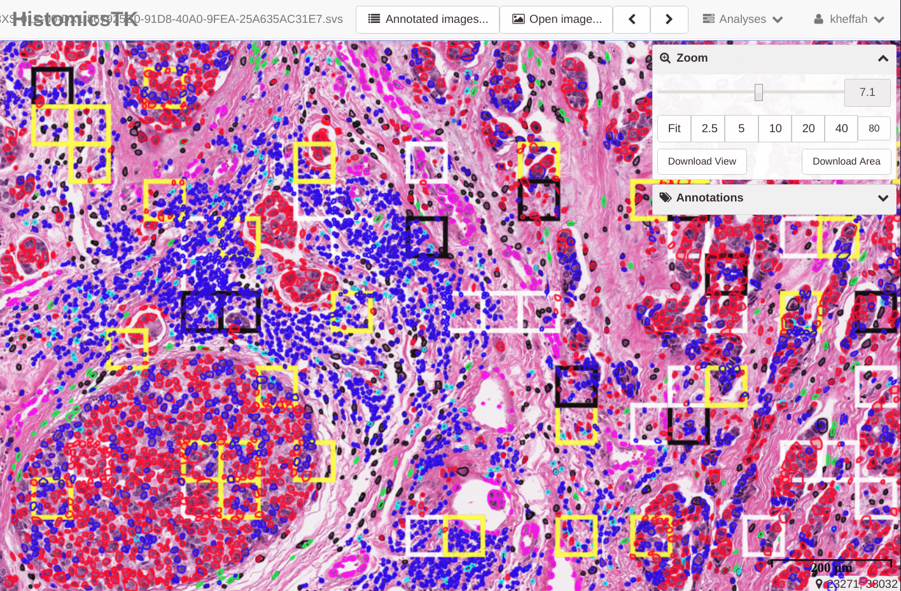
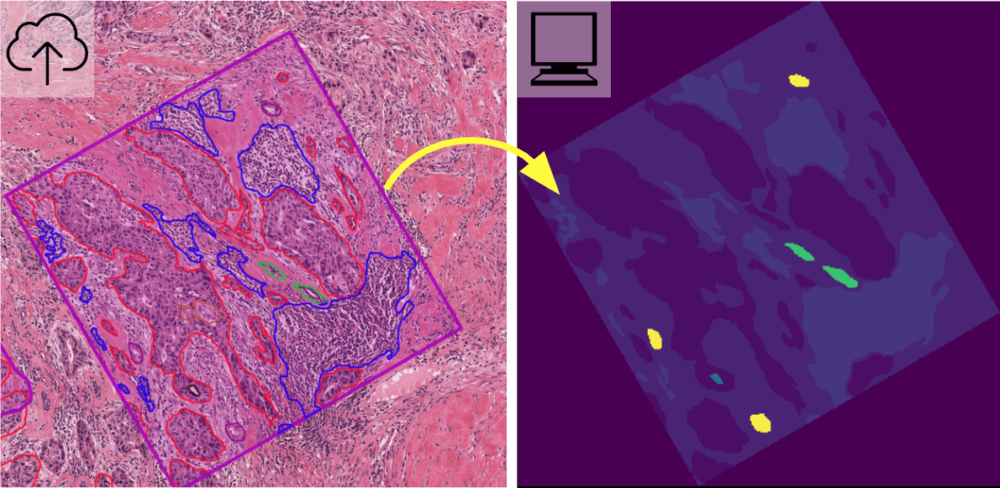
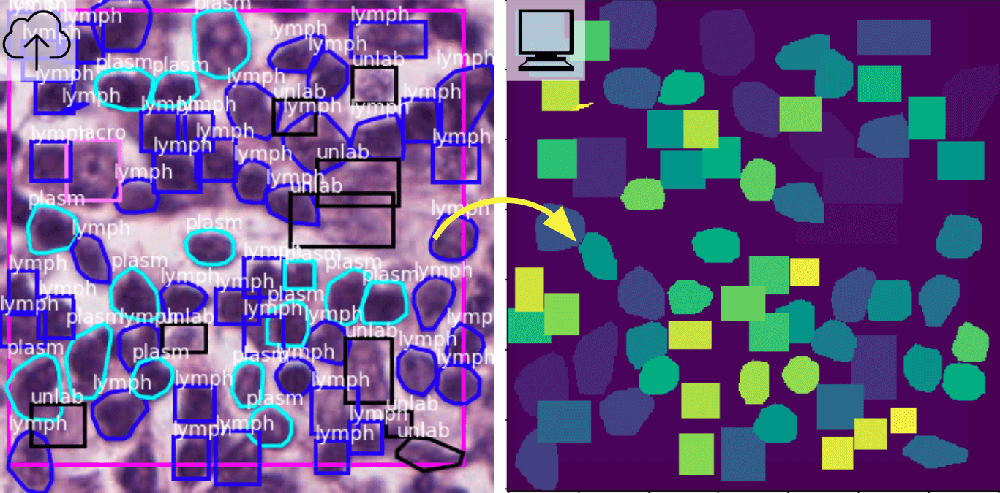
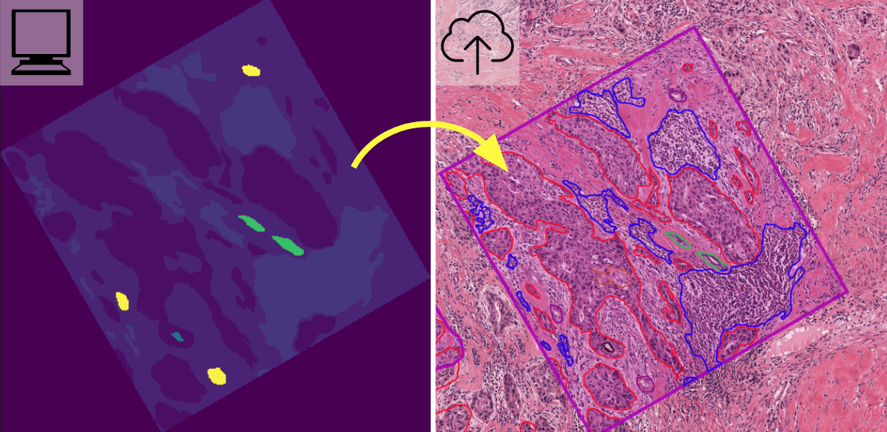
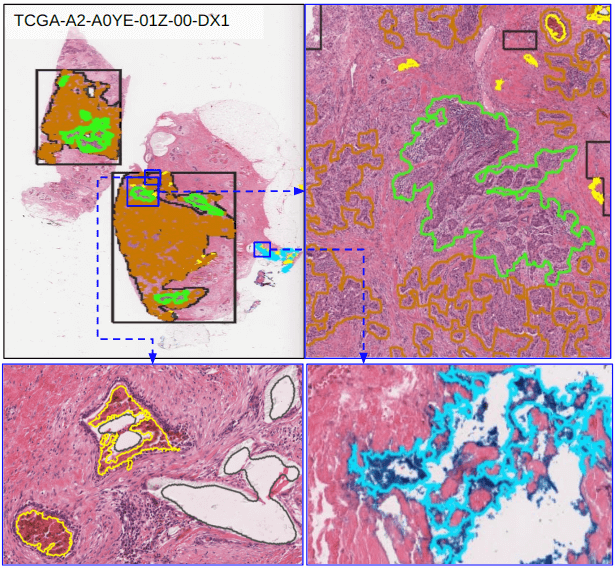
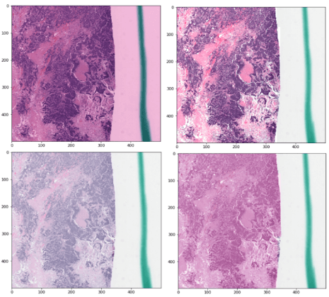

## 1. Managing an annotation project

{:class="box"}

Image markups are the essential ingredient in developing machine learning algorithms for digital pathology applications. HistomicsUI and DSA are designed for conducting distributed, multi-user studies to generate large annotation datasets, and have been used to produce over 250,000 human markups in our projects. In the following examples we illustrate how to use the HistomicsUI interface markup tools for users, and how to use the API to manage large multi-user annotation studies for developers.

### [1.1. For Users - using HistomicsTK markup tools](http://www.youtube.com/watch?v=HTvLMyKYyGs)

To introduce users to the HistomicsUI interface we created a video that illustrates how to navigate projects, how to use the markup tools to create annotations, how to edit annotations, how to generate annotation styles, and how to standardize styles using templates.

{:target="_blank"}

This video can be used as instructional material when conducting annotation studies and can help improve the quality of annotations that your collaborators generate in HistomicsUI.

### [1.2. Introducing the Girder API](https://digitalslidearchive.github.io/HistomicsTK/examples/introducing_the_girder_api)

A RESTful API allows developers to programmatically interact with a DSA server to manage data, user accounts, annotations, and their permissions. These functions are part of what makes DSA a powerful platform for generating annotations through distributed multi-user studies. In this example we discuss the basic elements of the DSA database, describe the structure of annotations, and illustrate a variety of methods for making DSA API calls. Visit [this page](https://digitalslidearchive.github.io/HistomicsTK/examples/introducing_the_girder_api) for more details.

### [1.3. Procedure for managing a typical annotation project](https://digitalslidearchive.github.io/HistomicsTK/examples/procedure_for_typical_annotation_project)

Conducting an annotation project requires careful planning and familiarity with how to manage users, data, and annotations in DSA. Here we describe considerations in planning for a successful annotation project and provide an overview of steps to start a project. Visit [this page](https://digitalslidearchive.github.io/HistomicsTK/examples/procedure_for_typical_annotation_project) for more details.

### [1.4. Tips for scaling annotation rendering](https://digitalslidearchive.github.io/HistomicsTK/examples/tips_for_scalable_annotation_rendering)

Image analysis algorithms and humans can generate large numbers of annotations. HistomicsUI is implemented for scalable rendering of annotations, and if you follow some basic principles you can avoid performance problems in rendering large numbers of elements and vertices. Visit [this page](https://digitalslidearchive.github.io/HistomicsTK/examples/tips_for_scalable_annotation_rendering) for more details.

### [1.5. Creating gallery images for annotation review](http://www.youtube.com/watch?v=Plh39obBg_0)

Annotation studies often involve the markup of structures within regions of interest (ROIs) that are typically orders of magnitude smaller than whole slide images. When reviewing these annotations, significant time is spent navigating between ROIs in a slide and across the entire slide collection. To enable rapid review HistomicsTK offers functions to assemble annotated ROIs into dense mosaic gallery images for visualization. These galleries eliminate the need for navigation between ROIs and also the need for toggling annotation visibility or adjusting magnification.

This video demonstrates the functionality of these galleries and [this example](https://digitalslidearchive.github.io/HistomicsTK/examples/creating_gallery_images_review) demonstrates the gallery creation process.

### [1.6. Local backup and SQL querying of annotation data](https://digitalslidearchive.github.io/HistomicsTK/examples/annotation_database_backup_and_sql_parser)

Annotations represent a significant time investment for the users who generate them and they should be backed up frequently. HistomicsTK has utility functions that allow the recursive backup of a girder database locally as a combination of JSON files (most similar to the raw format), tabular files (.csv), and/or an SQLite database. The SQLite database can easily be viewed using, for example, an [offline sqlite viewer](https://sqlitebrowser.org/dl/){:target="_blank"} or even an [online sqlite viewer](https://sqliteonline.com/){:target="_blank"}. More details can be found in [this notebook](https://digitalslidearchive.github.io/HistomicsTK/examples/annotation_database_backup_and_sql_parser).

## 2. Processing annotations and mask images

Theme text: The DSA database stores annotations in an (x,y) coordinate list format. For many processing tasks like training machine learning algorithms or measuring interobserver agreement a mask or label image representation is easier to work with. Similarly, the outputs of many algorithms are label or mask images that need to be converted to coordinates for visualization in HistomicsUI. In the following examples we illustrate how to convert between the coordinate list and image formats. We also demonstrate how to merge annotations that are split by tiled processing of whole-slide images.

### [2.1. Converting annotations to semantic segmentation mask images](https://digitalslidearchive.github.io/HistomicsTK/examples/annotations_to_semantic_segmentation_masks)

A semantic segmentation mask is an image where the value of a pixel encodes its membership in a class (e.g. tumor). This representation is useful in training and validating machine learning algorithms for tasks like tissue region segmentation. [This example](https://digitalslidearchive.github.io/HistomicsTK/examples/annotations_to_semantic_segmentation_masks) illustrates how to convert from annotations in the DSA database to semantic segmentation masks in a variety of scenarios.

### [2.2. Converting annotations to object segmentation mask images](https://digitalslidearchive.github.io/HistomicsTK/examples/annotations_to_object_segmentation_masks)

An object segmentation mask is an image where the value of a pixel encodes its belonging to a specific object or instance and optionally object class (e.g. a single nucleus or tumor nucleus). This representation is useful in training and validating machine learning algorithms for object detection, classification, and segmentation including [Mask R-CNN](https://arxiv.org/abs/1703.06870){:target="_blank"}. [This example](https://digitalslidearchive.github.io/HistomicsTK/examples/annotations_to_object_segmentation_masks) demonstrates conversion of annotation to object segmentation masks, along with a demonstration of differences between object and semantic segmentation mask images.

### [2.3. Converting mask images back to annotations](https://digitalslidearchive.github.io/HistomicsTK/examples/segmentation_masks_to_annotations)

One of the best ways to assess the performance of image segmentation algorithms is visualize their predictions as annotations in HistomicsUI. HistomicsTK provides functions to convert the label images produced by semantic and object segmentation models into a coordinate format that can be ingested into DSA and visualized. More details are provided [here](https://digitalslidearchive.github.io/HistomicsTK/examples/segmentation_masks_to_annotations).

### [2.4. Merging annotations from tiled analysis](https://digitalslidearchive.github.io/HistomicsTK/examples/polygon_merger_from_tiled_masks)

Tiled analysis of whole-slide images can break up large structures like tissue regions that span multiple tiles. HistomicsTK provides functions to merge annotations generated through tiled analysis to produce coherent annotations that span multiple tiles. These functions can accept inputs as a [tiled array of segmentation masks](https://digitalslidearchive.github.io/HistomicsTK/examples/polygon_merger_from_tiled_masks) or as an [unsorted collection of (x,y) coordinate lists](https://digitalslidearchive.github.io/HistomicsTK/examples/polygon_merger_using_rtree).

## 3. Image analysis with HistomicsTK

Theme text: HistomicsTK provides fundamental image analysis capabilities that developers can use in building complex digital pathology workflows. The HistomicsTK package is pip-installable and can be used as a stand-alone python library, or as a girder plugin for running image analysis jobs from the HistomicsUI interface. In the following examples we illustrate how HistomicsTK and the large_image library can be used for image analysis tasks and how to work with local image datasets or data hosted on remote DSA installations.

### [3.1. Local processing of whole-slide images using large_image](https://digitalslidearchive.github.io/HistomicsTK/examples/using_large_image)

The large_image python library (which is a dependency for HistomicsTK) allows users to conveniently work with large multiresolution images, providing functions for iterating through tiled representations of a digital slide or for seamlessly working on the same regions across different magnifications. large_image provides a single interface for working with a variety of tile sources including openslide, openjpeg, ometiff, and nd2. [This example](https://digitalslidearchive.github.io/HistomicsTK/examples/using_large_image) shows how to use large_image to extract pixel data in common image analysis templates.

### [3.2. Analyzing remotely hosted images with the girder client](https://digitalslidearchive.github.io/HistomicsTK/examples/workflows)

The gider python client allows developers to work with remotely hosted images in DSA instances via a RESTful web API. [This example](https://digitalslidearchive.github.io/HistomicsTK/examples/workflows) shows how to use the girder client to extract pixel data from DSA instances and to run image analysis workflows on this data locally.

### [3.3. Color deconvolution, normalization, and data augmentation](https://digitalslidearchive.github.io/HistomicsTK/examples/color_normalization_and_augmentation)

The first step in analyzing digital pathology images is often preprocessing the color image to correct staining or imaging variations or to isolate a stain of interest. These examples illustrate how to use HistomicsTK for [color deconvolution](https://digitalslidearchive.github.io/HistomicsTK/examples/color_deconvolution), and to [normalize color profiles](https://digitalslidearchive.github.io/HistomicsTK/examples/color_normalization_and_augmentation) and [generate augmented color images](https://digitalslidearchive.github.io/HistomicsTK/examples/color_normalization_and_augmentation) for machine learning.

### [3.4. Positive pixel count and parallel processing with Dask](https://digitalslidearchive.github.io/HistomicsTK/examples/positive_pixel_count)

Measuring IHC staining by a positive pixel count  is one of the most fundamental image analysis tasks in digital pathology. [Here](https://digitalslidearchive.github.io/HistomicsTK/examples/positive_pixel_count) we show how to apply positive pixel count to large images using Dask, a python library for parallel computing on clusters and multi-core systems.

### [3.5. Identifying salient regions in whole-slide images](https://digitalslidearchive.github.io/HistomicsTK/examples/semantic_segmentation_color_thresholding_approach)

Whole-slide images often contain artifacts like marker or acellular regions that need to be avoided during analysis. In this example we show how HistomicsTK can be used to develop saliency detection algorithms that segment the slide at low magnification to generate a map to guide higher magnification analyses. We first show how [superpixel analysis](https://digitalslidearchive.github.io/HistomicsTK/examples/semantic_segmentation_superpixel_approach) can be used to locate hypercellular regions that are tumor-rich. We then show how [colorspace analysis](https://digitalslidearchive.github.io/HistomicsTK/examples/semantic_segmentation_color_thresholding_approach) can detect various elements such as inking or blood, as well as hypercellular regions, to improve the quality of subsequent image analysis tasks.

